# Simple Chat App

## Requirements

- Write a Chat service as Python.
- A simple html/js client that uses the service is provided (index.html)

1. What is a Chat service?  
   A chat service accepts three APIs

2. Methods:

   a. `GET /<room>` - returns the static html provided to you, regardless of the room provided.  
   b. `GET /chat/<room>` - returns the full chat in a room, data is load from file `/data/<room>.txt` and show the page  
   c. `POST /chat/<room>` - accepts a chat line from a user

   - save to file `/data/<room>.txt`
   - accept 2 form fields - username & message
   - chat formatted as a list of "\n" delimited lines (1 per message)
   - each line formatted as "[2018-02-25 14:00:51] long.vu: hi everybody!"
   - save date, time, username & message per room

   `<room>` is the number such as 123 or 1234, etc.

3. Following is a recommendation on implementation order:  
   a. Implement Flask app that returns the static html on GET /.  
   b. Now add new page `GET /<room>` will show the same page above.  
   c. Implement `GET /chat/<room>` will show the data loaded from file (create by manual for now).  
   d. Implement `POST /chat/<room>` to save chat data. Check with another room and another browser.

4. DevOps Section  
    a. Package application in docker-image  
    b. Create docker-compose toplogy comprising of:

   - 3 chat servers
   - nginx container configured to load balance the 3 instances and expose them on port 80.  
      NOTE that you do not need to expose ports for any of the 3 servers!  
      You can read about nginx load balancing at  
     https://docs.nginx.com/nginx/admin-guide/load-balancer/http-load-balancer/ and https://www.nginx.com/resources/wiki/start/topics/examples/loadbalanceexample/  
     or just google it :-)

   c. Test and prove that:

   - You are accessing all 3 servers (The UI should show a friendly server name)
   - A chat message sent to one is visible on the others

   d. Make this work with arbitrary scaling, i.e. 1 nginx and several chat servers as defined by docker-compose "scale" parameter.  
    Note that in the case of --scale, it is good enough if the UI just shows any indication that differs between servers. It does not have to be "friendly"

5. Bonus Section  
   Replace the file based storage with a dockerized MySQL.

Implement as much as you can. Goodluck!!!

# Nice to have all results

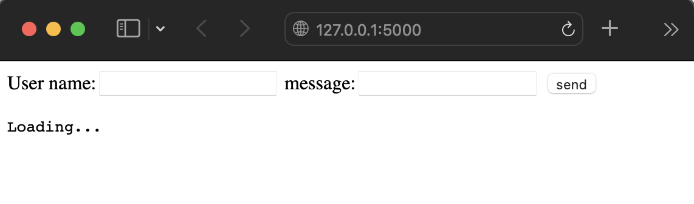
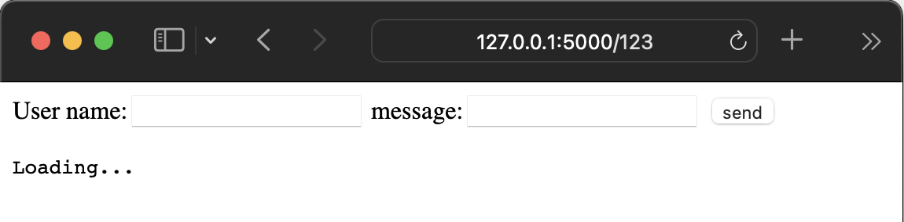
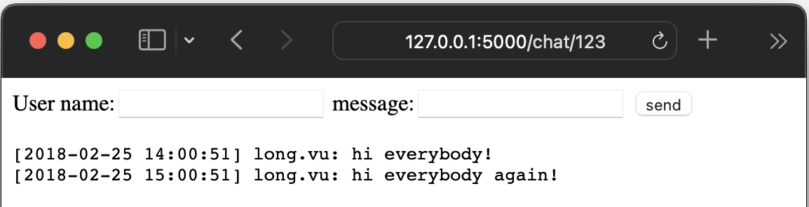

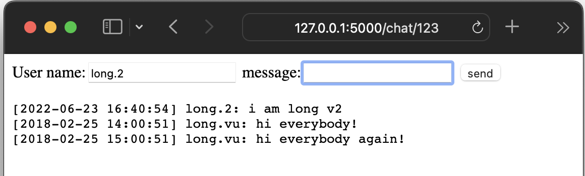
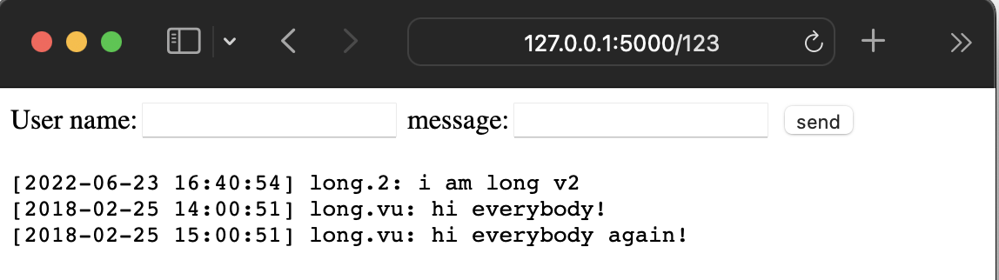

[Test with docker-container]

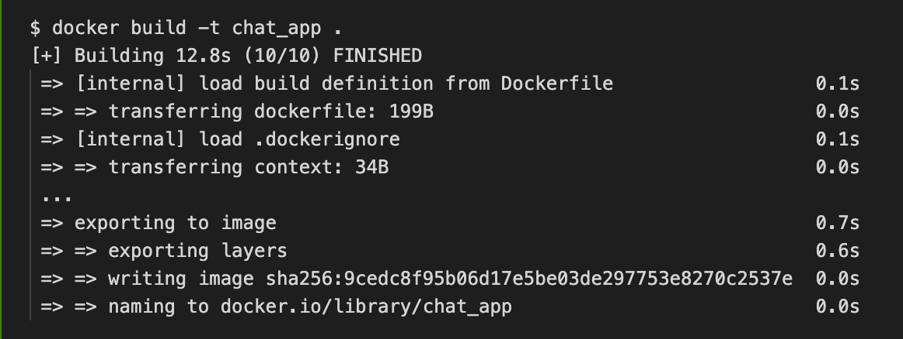
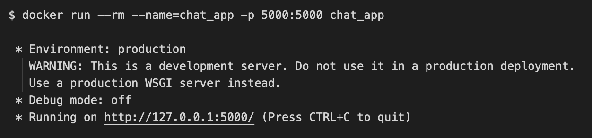
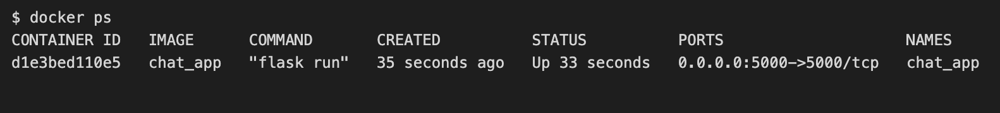

[Test with docker-compose]

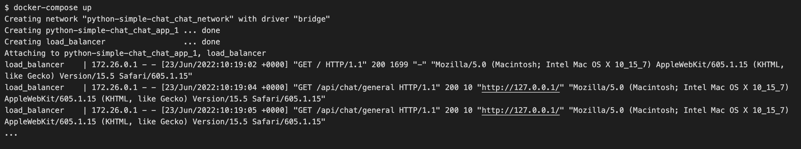
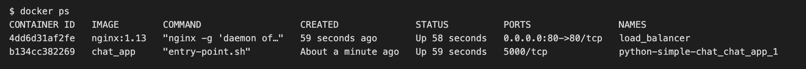

[Test with docker-compose --scale]

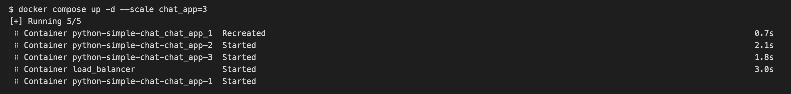
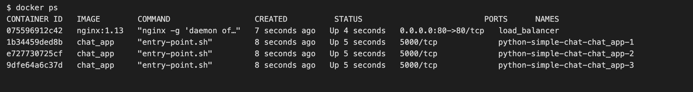
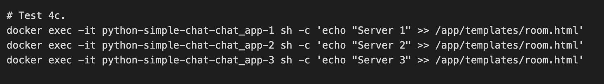
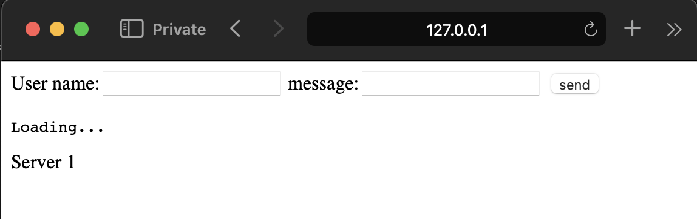
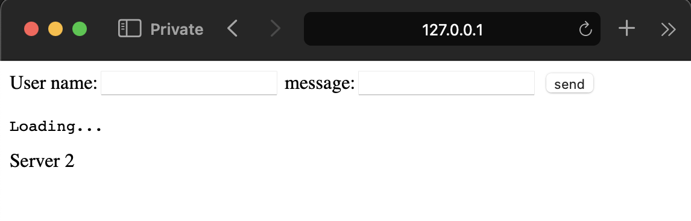
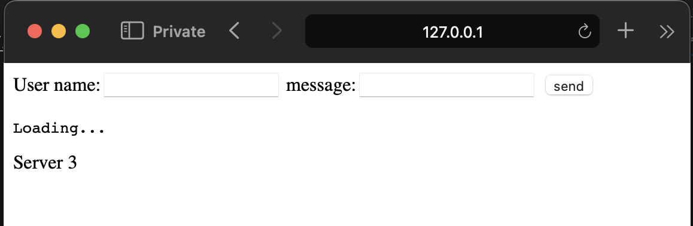
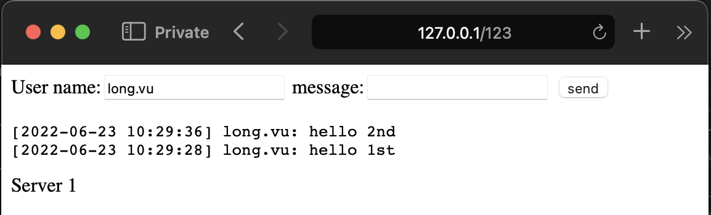

